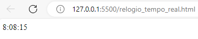

# Implementação de Códigos Prontos em JavaScript.
## Gerando Relógio em Tempo Real.

### Sobre o Código:
* [script](https://developer.mozilla.org/en-US/docs/Web/HTML/Element/script): O elemento &lt;script&gt; é usado para incorporar código ou dados executáveis; normalmente é usado para incorporar ou referir-se ao código JavaScript.
* [type]:O type é usado para especificar o tipo de conteúdo que essa tag link está importando, o valor do atributo deve ser um MIME type como "text/html", "text/css" e assim por diante.
* [function](https://developer.mozilla.org/en-US/docs/Web/JavaScript/Guide/Functions): Function é um dos blocos de construção fundamentais em JavaScript. Uma função em JavaScript é semelhante a um procedimento – um conjunto de instruções que executa uma tarefa ou calcula um valor, mas para que um procedimento seja qualificado como uma função, ele deve receber alguma entrada e retornar uma saída onde haja alguma relação óbvia entre o entrada e a saída. Para usar uma função, você deve defini-la em algum lugar do escopo a partir do qual deseja chamá-la.
* [var](https://developer.mozilla.org/pt-BR/docs/Web/JavaScript/Reference/Statements/var):O var declara uma variável, opcionalmente é possível atribuir à ela um valor em sua inicialização.
